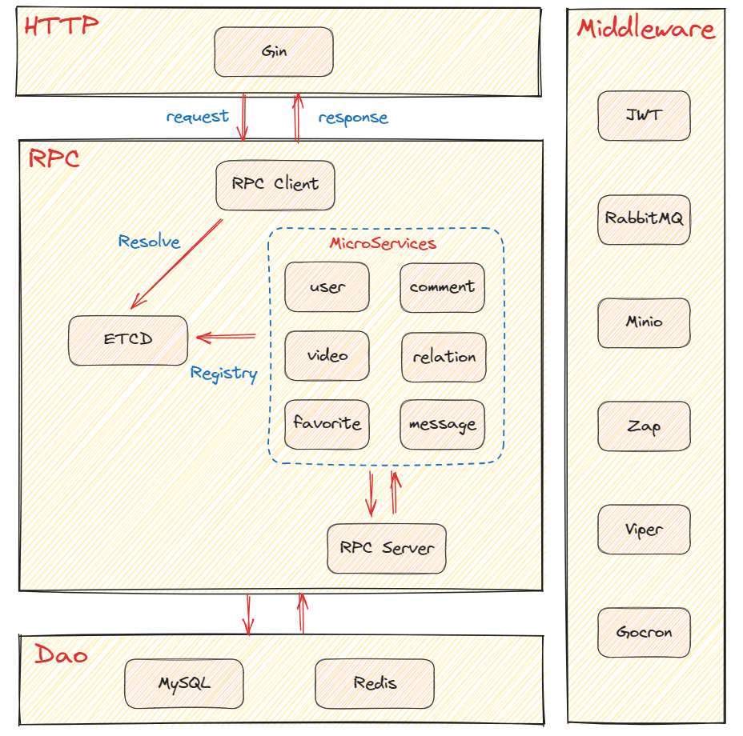

## wizh
极简版 b 站

### 前端
> 页面比较简洁，旨在练手
>
> [前端仓库](https://github.com/ning2510/wizh-web)

基于 React + AntDesign + Redux

### 后端
> [后端仓库](https://github.com/ning2510/wizh)

基于 Gin + Kitex 微服务框架

#### 项目介绍
> [ApiFox 接口文档](https://apifox.com/apidoc/shared-3161d555-dd58-4a19-b26e-ca0c100ff5a0/api-133563997)

项目支持 Docker 部署

**架构设计**

项目采用微服务的架构，分为 HTTP、RPC 和 DAO 三层
- HTTP 层使用 Gin 框架
- RPC 层使用 Kitex 框架，并用 ETCD 做服务注册和服务发现
- DAO 层为数据访问层，包括 Redis 和 MySQL

**架构图**



**技术栈**
- Gin：提供 HTTP 服务
- Kitex：提供 RPC 服务
- ETCD：服务注册和服务发现
- Gorm：操作 MySQL
- Go-Redis：操作 Redis
- RabbitMQ：对 Redis 的异步操作
- JWT：token 的生成与校验
- Minio：图片和视频的对象存储
- Gocron：定时任务，同步 Redis 到 MySQL
- Viper：读取配置文件
- Zap：日志打印

**目录结构介绍**
```shell
.
├── build.sh                # 项目启动脚本
├── cmd
│   ├── api                 # api 服务代码
│   │   ├── handler
│   │   ├── main.go         # 项目入口代码
│   │   ├── router          # 路由
│   │   └── rpc             # 各服务 RPC 的发送和服务发现
│   ├── comment             # comment 微服务代码
│   │   ├── main.go         # comment 服务入口代码
│   │   └── service
│   │       └── handler.go  # 核心处理代码
│   ├── favorite            # favorite 微服务代码
│   ├── message             # message 微服务代码
│   ├── relation            # relation 微服务代码
│   ├── user                # user 微服务代码
│   └── video               # video 微服务代码
├── config                  # 配置文件目录
├── dao
│   ├── db                  # 操作 MySQL 的代码
│   │   ├── test            # 测试代码
│   │   └── wizh.sql        # 创建数据库文件
│   └── redis               # 操作 Redis 的代码
├── docker-compose.yaml     # docker-compose 文件
├── dockerfiles             # 存放 Dockerfile 文件
├── internal
│   ├── response            # 封装各服务返回的结构体
│   └── tool                # 常用工具
├── kitex
│   ├── comment.proto       # comment 的 proto 文件
│   ├── favorite.proto
│   ├── kitex_cmd.sh        # kitex 代码生成命令
│   ├── kitex_gen           # kitex 生成的代码
│   ├── message.proto
│   ├── relation.proto
│   ├── user.proto
│   └── video.proto
├── pkg
│   ├── auth                # 鉴权
│   ├── errno               # 错误码实现
│   ├── etcd                # 服务注册和服务发现
│   ├── gocron              # 定时任务
│   ├── jwt                 # token 的生成与检验
│   ├── middleware          # 常用的中间件
│   ├── minio               # 对象存储
│   ├── rabbitmq            # 消息队列
│   ├── viper               # 配置文件读取
│   └── zap                 # 日志
└── README.md
```

**项目启动**

- **创建 Docker 容器**
```shell
docker-compose up -d
```

- **通过 `build.sh` 启动或停止项目**

```shell
Use: ./build.sh [opts] [service]

Options:
	init, install  - 安装项目依赖
	start					 - 启动服务 
	stop					 - 停止服务
	info					 - 查看服务信息
	ls						 - 查看服务会话列表
	
Service:
	comment
	favorite
	message
	relation
	user
	video
	api
```

- **安装项目依赖**
```shell
./build.sh install
```

- **启动服务**
```shell
./build.sh start	    # 启动所有服务
./build.sh start api	# 启动 api 服务
```

- **停止服务**
```shell
./build.sh stop			# 停止所有服务
./build.sh stop api		# 启动 api 服务
```

- **查看服务信息**
```shell
./build.sh info api		# 查看 api 服务
./build.sh info user	# 查看 user 服务
```

- **查看服务会话列表**
```shell
./build.sh ls
```